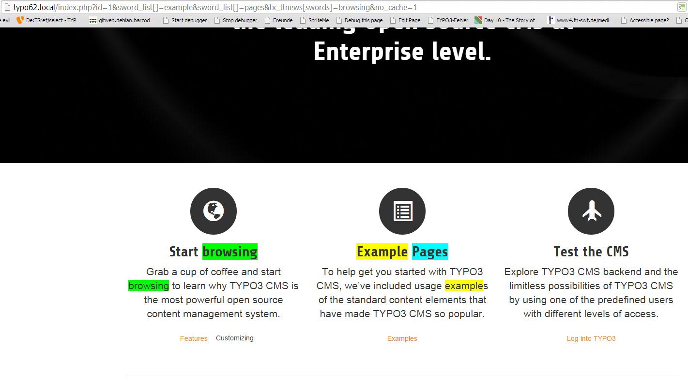

.. ==================================================
.. FOR YOUR INFORMATION
.. --------------------------------------------------
.. -*- coding: utf-8 -*- with BOM.

.. include:: ../Includes.txt

.. _introduction:

Introduction
================

.. _what-does-it-do:

What does it do?
----------------

This extension implements a css highlighting for requested search words, url calls via google referrer or other url params on the destination page.
The extension bases on code from psm_highlight and was rebuilt for TYPO3 6.2 compatibility.

.. _team: http://forge.typo3.org/projects/typo3v4-official_extension_template/issues

For instance you use indexed_search and search for the word "example".
Now you can add the search word to the typolink for url generation in indexed_search result list.
In requested page you see the search word highlighted.

.. _screenshots:

Screenshots
-----------

	See search words given as url params highlighted on page (caption of the image)

