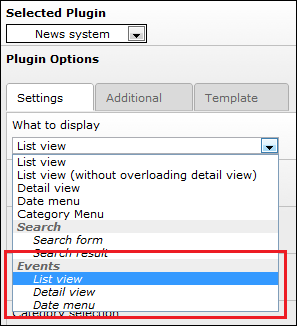
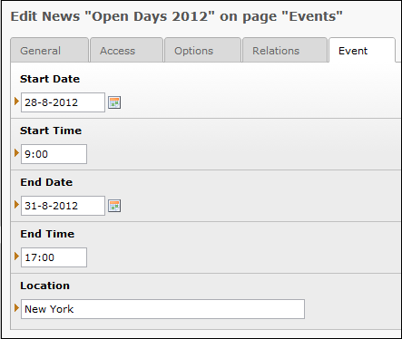

.. ==================================================
.. FOR YOUR INFORMATION
.. --------------------------------------------------
.. -*- coding: utf-8 -*- with BOM.

.. include:: ../Includes.txt

=====================
Introduction
=====================

What does it do?
----------------

The news event extension extends the versatile news system extension with additional event functionality.

Screenshots
-----------

This section shows screenshots of the news event extension. Please note that only the settings which are applicable for the news event extension are visible.

    **Image 1:** News plugin with available event views

    
    **Image 2:** Mark a news record as event, and add event data