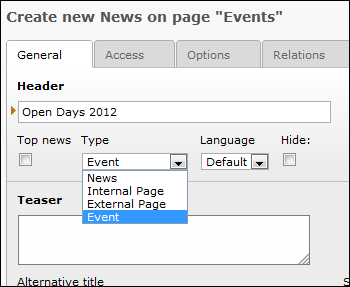
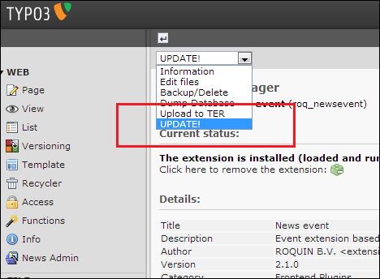
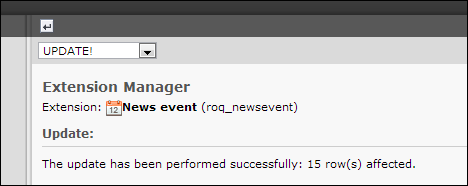

.. ==================================================
.. FOR YOUR INFORMATION
.. --------------------------------------------------
.. -*- coding: utf-8 -*- with BOM.

.. include:: ../Includes.txt

=====================
Tutorial
=====================

General
------------------------

Since this extension extends the versatile news system extension, it is recommended to first read the news system
documentation. All the described news system settings in this documentation apply to the news event extension as well,
and this section only describes the additional event features of news event.

How to add an event section to your site
----------------------------------------
This section describes how to implement the extension news event in your TYPO3 installation.

Installation
''''''''''''
Before you can install this extension, please make sure the news system extension has been installed. See the news system documentation for more information.

After the installation of the news system you can install the news event extension in the same way:

#. Switch to the module “Extension Manager”.
#. Get the extension from the Extension Manager (TER)

Preparation: Include static TypoScript
''''''''''''''''''''''''''''''''''''''
Be aware that before any plugin can be rendered in the frontend it is necessary to include the static TypoScript of news event. This is very easy:

#. Switch to the template module and to the your template record.
#. Add the news extension to the “Include Static” list.

*Important: make sure that you include the news event static template after the news system static template!*

Create news event records
''''''''''''''''''''''''''
Before any news events can be shown in the front-end they must be created by adding news event records:

#. Therefore, create a new sysfolder and switch to the list view (it is preferable to create a seperate sysfolder for news event records next to your news records to keep your records organized)
#. Optionally you can create a seperate news category for news events. See the news system documentation for more information.
#. Use the icon in the topbar “Create new record” and search for “News system” and its records. You should see “News”, “News category” and “News Tag”. Click on “News” to create a new news record.
#. Click on the 'Event' tab and check the 'Is event' checkbox to mark the news record as an event (see: Image 2).
#. Fill in the necessary event information (at least an event start date), which is required to make the event visible in the frontend. Please note that events without a start date will not be visible in the front-end.

Add a plugin to a page
''''''''''''''''''''''
Add a new page (for instance 'Upcoming events') to which you can add the news system plugin. See the news system documentation to read more on how to add this plugin. When you have added the plugin to the newly created page, edit the plugin settings, and:

#. Change the 1st select box from 'What to display' to 'List view' beneath the 'Event' section in the select box (see: Image 1).
#. Select 'Only active (non archived)' below 'Archive' to only show all current and future events. Past events will be shown if 'Archived' has been selected. You can use this on a seperate page (on which you've added the plugin as well) to create an event archive section.
#. Point the starting point to the sysfolder pid where you have stored the news event records.
#. Save the plugin.

Optionally, you can create a seperate event detail and list page, as described in the news system documentation (see
section: 'Add a plugin to a page'). In the example above the list view and detail view is the same page. Because of this
the plugin setting 'Show a single news record' has been left empty.

Viewhelpers
"""""""""""
Every Fluid ViewHelper starts with <f:. and you can always check out the code at typo3/sysext/fluid/Classes/ViewHelpers/. As an example the ViewHelper <f:link.page can be found at
typo3/sysext/fluid/Classes/ViewHelpers/Link/PageViewHelper.php.

Any other ViewHelper from other extensions can be used by using a namespace declaration like::

    {namespace e=Tx_RoqNewsevent_ViewHelpers}

Then ViewHelpers of EXT:RoqNewsevent (which can be found in roq_newsevent/Classes/ViewHelpers) can be used with
the prefix e:.

Updating from version 2.0.x
----------------------------
Please read this section carefully, if you already have news event version 2.0.x installed, and want to update to version
2.1.x of news event.

What has been changed?
''''''''''''''''''''''
Earlier, with version 2.0.x, news event added a new news type called 'Event', as show below:

    **Image 3:** The removed 'Event' news type

This type has been removed, and replaced with a checkbox 'Is event' in the event tab from versions 2.1.0. Because of
this, the news types 'External Page' and 'Internal Page', also can be used for events. This was not possible in the way we
handled events in previous versions.

Ok, but what does this mean?
''''''''''''''''''''''''''''
This means that the way news event records are stored has been changed. Because of this, you need to update older
news events records to the new format after performing the update, by running the update script. Otherwise the older
records will not be recognized as news event records.

Update and running the update script
''''''''''''''''''''''''''''''''''''

1. First, update the news event extension to the latest version by using the TYPO3 'Extension Manager' like you normally would do.
2. After you've successfully performed the update, go to the “Loaded extensions” list in the TYPO3 “Extension manager”, and click on the News event extension.
3. Click on the Extension manager selectbox on the top, and check if the item 'UPDATE!' is available from the selectbox in the top, as shown in the image below

    **Image 4:** Run the update script

4. If this option is not available, you've already performed this update or there are no news records available which must be updated:
5. Finally, click on 'UPDATE!' to update all old news event database records. From now all older news event records are converted to the newer format. Please note: The 'UPDATE!' option will disappear when the update has performed successfully:

    **Image 5:** Result of the update script

Updating to version 2.1.3
-------------------------

In version 2.1.3 the default templates have been modified. So if you've modified these templates (or a copy of them),
please check this section to update your templates with these changes.

What has been changed?
''''''''''''''''''''''
The link view helper for linking the event to the event detail page. The action argument has been removed. This can
result in this error if you are using older templates: “Argument "action" was not registered. ”.

Ok, but what does this mean?
''''''''''''''''''''''''''''
You have to remove the action argument from the link view helper in the following fluid templates:

- Event list item partial, default location: /Partials/EventList/Item.html
- Event detail template, default location: /Templates/News/EventDetail.html

So change::

    <e:link newsItem="{newsItem}" settings="{settings}" action="eventDetail">

Into::

    <e:link newsItem="{newsItem}" settings="{settings}">

And finally modify the Eventlist.xml (default location: /Templates/News/) the n:link into an e:link. So change::

    <n:link newsItem="{newsItem}" settings="{settings}" configuration="{returnLast:'url'}" hsc="TRUE"></n:link>

Into::

    <e:link newsItem="{newsItem}" settings="{settings}" configuration="{returnLast:'url'}" hsc="TRUE"></e:link>

Updating to version 3.0.0
-------------------------

Version 3.0.0 is the release for TYPO3 CMS 6.2 LTS. This version works for TYPO3 6.2.x only, and older TYPO3 versions with this version.

Instructions
''''''''''''
- Please read the news extension changelog and documenation carefully before updating, see: http://docs.typo3.org/typo3cms/extensions/news/Main/Changelog/3-0-0.html
- Also the default templates have been modified. Please update your templates if you've created custom templates to implement these changes in your templates.

