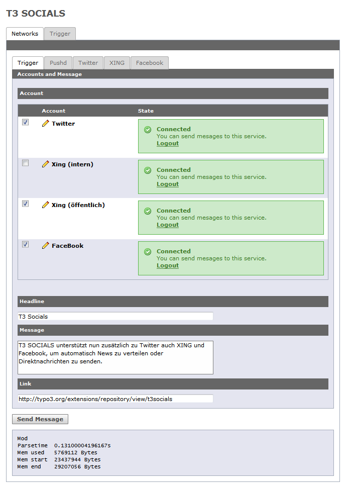
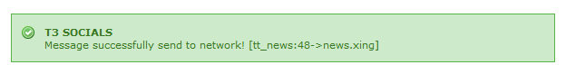
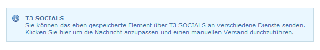
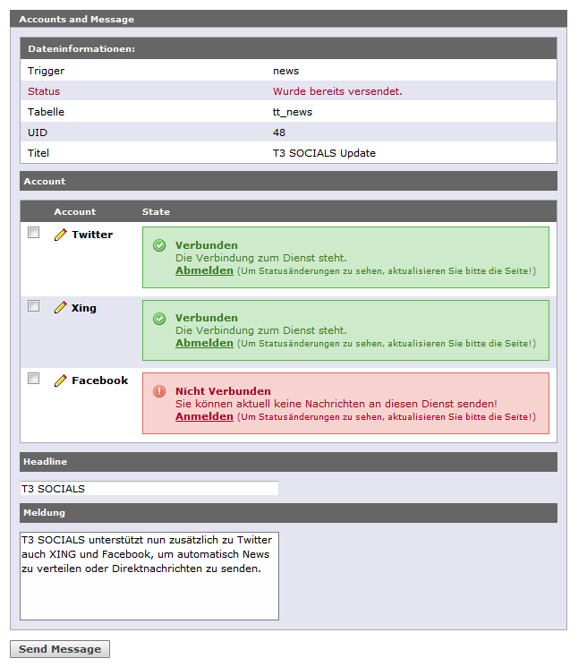

.. ==================================================
.. FOR YOUR INFORMATION
.. --------------------------------------------------
.. -*- coding: utf-8 -*- with BOM.

.. include:: ../Includes.txt

.. _dispatch:

Verteilen von Meldungen
=======================

.. _dispatch-custom:

Freie Meldungen
---------------

Über das *T3 SOCIALS* Modul ist es sehr einfach möglich,
eine Statusmeldung an verschiedene Accounts auf einmal zu verteilen. 

Im oberen Bereich werden alle konfigurierten Dienste
und deren Status aufgelistet.

Hier können alle Dienste markiert werden,
an die eine Meldung verteilt werden soll.

Im unteren Bereich des Moduls wird der Inhalt der Statusmeldung verfasst.
Dafür stehen mehrere Felder wie *Überschrift*, *Nachricht* und *Link*
zur Verfügung.

Bei den unterschiedlichen Diensten ist zu beachten,
das der angegebene Text der Nachricht
speziell für jeden Dienst automatisch angepasst wird.
Dies ist notwendig, da beispielsweise für Twitter maximal 140 und
für XING höchstens 420 Zeichen inklusive News-Link übermittelt werden dürfen.

Der Text wird dann automatisch an die Maximallänge
der einzelnen Dienste angepasst, an die Überschrift gehängt
und durch die ggf. angegebene URL ergänzt. 

Nachdem der Prozess zur Verteilung über den Button *Send Message* angestoßen
und abgearbeitet wurde, werden für alle Dienste Meldungen
zum Erfolg oder auch Misserfolg angezeigt.

.. _dispatch-news:

Verteilen von News
------------------

News können automatisiert beim Speichern oder
manuell über das *T3 SOCIALS* Modul auf die Dienste verteilt werden.

Zunächst werden News nur an Dienste verteilt,
welche als Trigger *News* gesetzt haben.
Siehe dazu Abschnitt *Triggers for network access* unter :ref:`accounts`.

.. _auto-dispatch-news:

Automatische Verteilung
^^^^^^^^^^^^^^^^^^^^^^^

Damit eine News direkt beim Speichern automatisch an die konfigurierten
Dienste verteilt werden kann, muss in der Dienstkonfiguration der Punkt
*Autosend on save for triggers* aktiviert sein.

Siehe dazu Abschnitt *Autosend on save for triggers* unter :ref:`accounts`

Eine News wird nur verteilt, wenn folgende Punkte zutreffen:

- Es ist ein Dienst mit dem Trigger für News definiert.
- Es ist ein Dienst für den automatischen Versand konfiguriert.
- Die News ist aktiv (nicht *Verborgen*)
- Die News wurde vorher noch nicht über einen Dienst verteilt.

Eine entsprechende Meldung nach dem Speichern der News wird ausgegeben.

.. _manual-dispatch-news:

Manuelle Verteilung
^^^^^^^^^^^^^^^^^^^

Wenn Dienste mit einem Trigger für News definiert sind,
wird nach dem Speichern eine Info ausgegeben, welche den Nutzer über
die Möglichkeit der Verteilung über die Dienste informiert.

Das Ziel, des in der Info enthaltenen Links, ist
das *T3 SOCIALS* Backendmodul zum Versenden einer News.

Im Kopfbereich werden Informationen wie
Tabelle, ID und Titel der News zum Datensatz ausgegeben.

Auch ein Status der News ist hier zu finden.
Beispielsweise wird darüber informiert,
ob diese News bereits an Dienste versendet wurde.

Darunter werden alle Dienste aufgelistet,
welche über den Trigger für die News konfiguriert wurden.

Siehe dazu Abschnitt *Triggers for network access* unter :ref:`accounts`

Hier können nun alle Dienste markiert werden,
an welche diese News verteilt werden soll.

Darunter gibt es die Möglichkeit den Text der News für alle Dienste
noch mal anzupassen.
