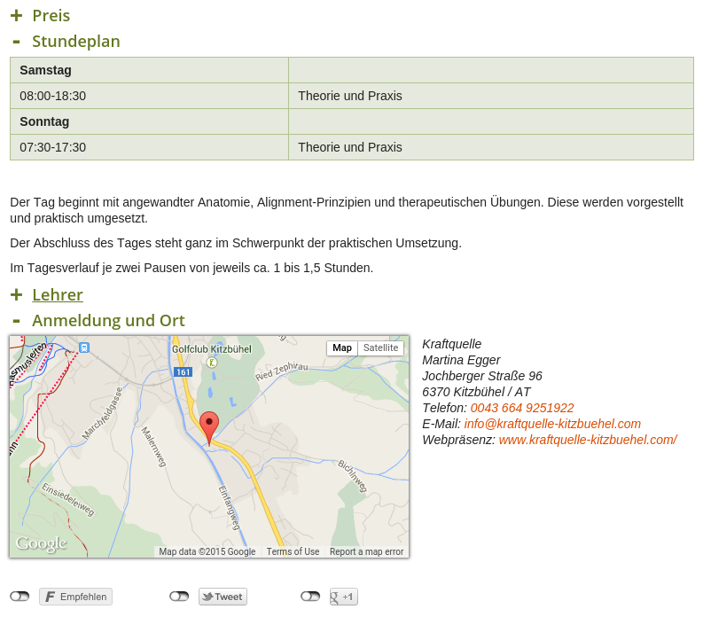

.. ==================================================
.. FOR YOUR INFORMATION
.. --------------------------------------------------
.. -*- coding: utf-8 -*- with BOM.

.. include:: ../Includes.txt

Introduction
============

This extension allows en editor to mark a content element as sliding element. The element can initially be visible (expanded) or hidden (collapsed) and it can be expanded/collapsed with a single click on it's header. This feature can be used with or without AJAX. User can chose one of three animations: slide downwards, slide upwards and fade.
Several live examples of this extension can be found on www.df.eu, e.g. in the FAQ area or for the fine print in the footer of many pages.

	Example of contentslide elements in frontend

Picture above shows 4 content elements: 'Preis' (collapsed), 'Stundeplan' (expanded), 'Lehrer' (collapsed) and 'Anmeldung und Ort' (expanded). From this example, it is clear that slidable content elements can contain various content (images, tables, text, etc.).