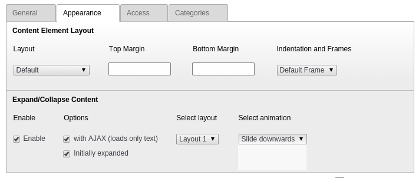

.. ==================================================
.. FOR YOUR INFORMATION
.. --------------------------------------------------
.. -*- coding: utf-8 -*- with BOM.

.. include:: ../Includes.txt

.. _users-manual:

Users manual
============

Content slide can be enabled via TYPO3 backend by editing a content element. "Enable" checkbox is located in "Appearance" tab on "Expand/Collapse Content" panel and by checking it, additional content slide options will displayed:

- With AJAX (loads only text)
	This option can be useful if the element itself is expensive, because of lot of images or if you just want to hide the text from search bots.
- Initially expanded
	If checked the content will be initially visible, otherwise it will be collapsed.
- Select layout
	By default, only one layout is implemented, but this option allows users to make their own custom layouts.
- Select animation
	Allows users to change sliding animation:
	- slide downwards
	- slide upwards
	- fade

	Backend configuration of contentslide element
