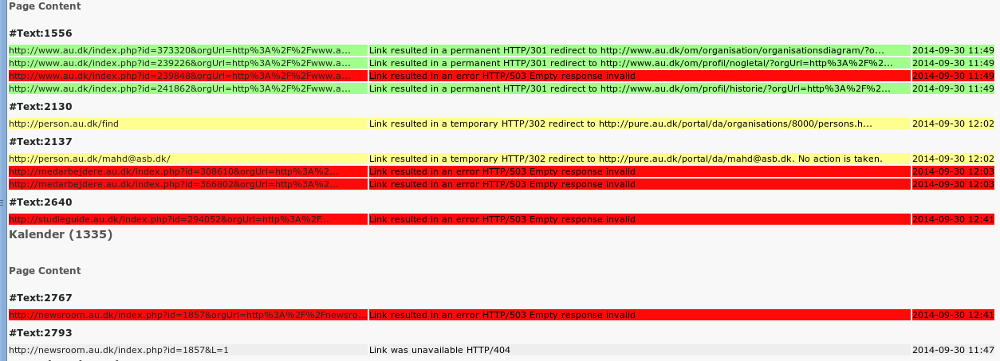

.. ==================================================
.. FOR YOUR INFORMATION
.. --------------------------------------------------
.. -*- coding: utf-8 -*- with BOM.

.. include:: Includes.txt

.. _start:

===========
Linkservice
===========

.. only:: html

   :Classification:
      linkservice

   :Version:
      |release|

   :Language:
      en

   :Keywords:
      seo,link,refresh,validation,crawler

   :Copyright:
      2014

   :Author:
      Daniel Schledermann

   :Email:
      daniel@linkfactory.dk

   :License:
      This document is published under the Open Content License
      available from http://www.opencontent.org/opl.shtml

   :Rendered:
      |today|

   The content of this document is related to TYPO3,
   a GNU/GPL CMS/Framework available from `www.typo3.org <http://www.typo3.org/>`_.

   **Table of Contents**

.. toctree::
   :maxdepth: 5
   :titlesonly:
   :glob:

Introduction
============

What does it do
---------------
Linkservice is a tool that can maintain the external links in you TYPO3 installation.
It does so by crawling each link using the CURL HTTP-client and listening for "301 Moved Permanently" responses.

Configuration
=============
Configuration is done with the extension configuration upon install.
No special care is nessesary since the defaults are workable in most cases.
However these settings can be tuned:

* field_linkservice -
  Define which fields you need to refresh links in.
  The default is just tt_content.bodytext.
  However any RTE-text field will do.
  A common selection could be tt_news.bodytext or even a field on a custom extension.
  The only requirement is that it is a text field and that the links are encoded using RTE-style <link http://.../> or HTML-style <a href="http://.../">.

* link_validity_period -
  This is a validity period for each link.
  It is important when links might appear in more than one record.
  If the crawler discover the same link within this period, it will skip the HTTP-session an use a cached answer.

* field_validity_period -
  The validity for each field record.
  This means that the field will not be rechecked if last check was less than this period.

* records_per_run -
  This is a performance setting that limits the number of records processed in each invocation of the crawler.

* http_timeout -
  This is the timeout defined for a link.
  The default is a mere 5 seconds.
  A longer timeout would delay the crawling process and a long time is propably just a stressed server.
  You can adjust the time up to 60 seconds if you wish to get a more standard compliant behaviour.

* generate_report -
  This make a report viewable for the editors so they can get information on changed links.

* log_retention -
  A timeout for the crawler log.

Setting up scheduler jobs
-------------------------
In order for the crawler to function the scheduler jobs should be activated.
There are two jobs that should both be activated.

Link refresher
~~~~~~~~~~~~~~
This is the crawler, the job doing the link validator and rewriting.
The link refresher both edits the content fields and induces a performance penalty on the site.
For this reason you can consider placing the execution time outside normal work hours.
The link refresher will take each record/field in order.
As the records are refreshed a field "lastcheck" is maintained and used to determine when the record should be refreshed next time.
You should calculate the number for records to check.
This number should be less than "records_per_run" multiplied by the number of invocations of the link refresher within "field_validity_period".
If this is not the case you will not get a predictable refresh time for your links.

Link log cleaner
~~~~~~~~~~~~~~~~
This is a cleaning job for removing stale log data.
The interval should be greater than the "field_validity_period".

Handling codes
--------------

Link refreshing
~~~~~~~~~~~~~~~
All request done from the link refresher is done with the HEAD request method.
This should lower bandwidth usage, but do not expect the server load to be wastly different.
The link is refreshed only if both a "HTTP 301 Moved Permanently" answer is issued and a proper Location:-header is set.
Link refreshing does not handle not found class (HTTP 4xx) responses.
In particular a "HTTP 410 Gone" does not remove a link.

Logging
~~~~~~~
If logging is activated, any response that is not "HTTP 200 OK" will be logged, so that editor will be able to review all links in the content.

Editor usage
============

Reviewing links
---------------
To review link status the editor should use the "Web>Dead links" module.
The modules provides a graphical representation of the link refresher log.
There are colour codes representing status of the received response.

* Green -
  A resource is moved and link was refreshed in a proper way.
  No further action is normally needed.

* Yellow -
  Normally a link change should result in "HTTP 301 Moved permanently" being emitted by the server.
  If a "HTTP 302 Found" is received the editor might want to change the link, but the status code is only considered to be temporary, so linkservice will not change them.
  Instead the editor is notified.

* Grey -
  A resource not found or available (HTTP 4xx class) response.
  Nothing will be done automatically.
  In case of a HTTP 410 Gone or HTTP 401 Unauthorized the editor could consider removing the link.
  Otherwise the issue may be due to misconfiguration and might resolv itself.
  
* Red -
  The link had a techninal error (HTTP 5xx class).
  This might resolve itself, but should be reported.
