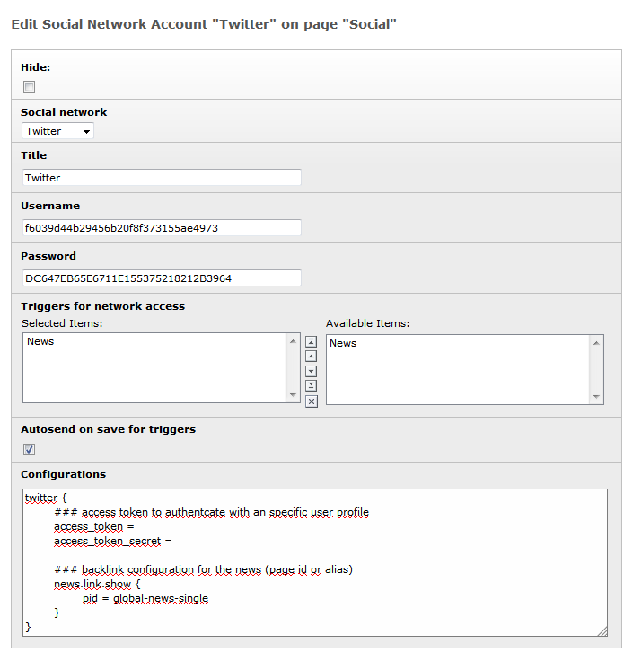
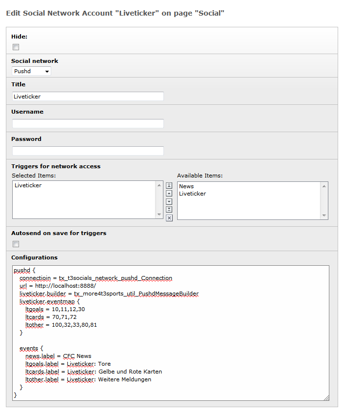
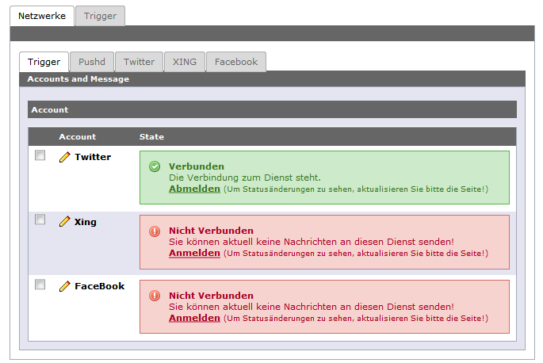
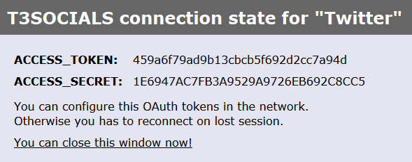

.. ==================================================
.. FOR YOUR INFORMATION
.. --------------------------------------------------
.. -*- coding: utf-8 -*- with BOM.

.. include:: ../Includes.txt

.. _accounts:

Accounts
========

Nach der Installation der Extension müssen zunächst
die benötigten Accounts eingerichtet werden.
Dafür am besten einen neuen Storage-Folder anlegen.
In diesem wird dann ein Datensatz vom Typ Social Network Account erstellt.

.. _einrichtung-twitter:

Einrichtung für Twitter
-----------------------

In der Auswahlbox für *Social network* gibt man den gewünschten Dienst an.

In unserem Fall ist dies Twitter.
Es können beliebig viele Accounts für ein Netzwerk angelegt werden!

In das Feld *Username* muss der *API key*
und in das Feld *Passwort* der *API secret* der Twitter App eingetragen werden.

Die in der Abbildung aufgeführten API Schlüssel
entsprechen keiner realen App und müssen ersetzt werden.

Im Feld *Trigger for network access* können bestimmte Datentypen definiert werden,
welche von T3 SOCIALS verteilt werden können.

Aktuell sind hier nur News (tt_news) möglich. Im Abschnitt für die Entwickler 
ist nachzulesen, wie man weitere Datentypen implementieren kann.

Die Auswahl *Autosend on save for triggers* legt fest,
ob beim Speichern, die unter *Trigger for network access* gewählten
Datensätze, automatisch an den Dienst (hier Twitter) verteilt werden sollen.

Ein Datensatz wird immer nur einmal automatisch verteilt und nie mehrfach!

Alle weiteren Konfigurationen werden im Feld *Configurations*
in einer TypoScript-Notation gemacht.

Wenn eine Verteilung der Daten ohne eine Nutzerauthentifizierung geschehen soll,
dann müssen unter *access_token* und *access_token_secret*
die Token des Accounts hinterlegt werden, an dessen Pinnwand 
die News abgesendet werden soll.

.. code-block:: ts

   twitter {
      access_token = 
      access_token_secret =  
   }

Um einen Backlink auf die Newsmeldung bereitzustellen,
muss die News-Detailseite konfiguriert werden.
Auch dies erledigt man in Feld *Configurations*:

.. code-block:: ts

   twitter {
      news.link.show.pid = global-news-single
   }

Bei pid wird die UID oder der Alias der Detailseite eingetragen.

.. _einrichtung-xing:

Einrichtung für XING
--------------------

Die Konfiguration eines Accounts für Xing
ist identisch zu :ref:`einrichtung-twitter`

.. _einrichtung-facebook:

Einrichtung für Facebook
------------------------

Die Konfiguration eines Accounts für Facebook
ist identisch zu :ref:`einrichtung-twitter`

.. _einrichtung-pushd:

Einrichtung für pushd
---------------------

Das Vorgehen bei pushd ist ganz ähnlich.
Auch hier muss ein Account-Datensatz angelegt werden.
Für die Anbindung an pushd muss lediglich die URL konfiguriert werden.
Die Absicherung der Verbindung erfolgt in pushd.

.. code-block:: ts

   pushd {
      url = http://localhost:8888/
   }

Bei pushd besteht eine Besonderheit darin,
dass der Dienst sogenannte Events unterstützt.
Smartphone-Nutzer können sich über diesen Weg für bestimmte Events registrieren.
Diese Events können serverseitig frei definiert werden.
Die Anbindung von T3 SOCIALS unterstützt diese freie Vergabe.
Daher müssen zunächst die gewünschten Events
in der Konfiguration angelegt werden.
Für die in der Standardkonfiguration unterstützten
News mag das überflüssig erscheinen.
Denn wir tragen einfach folgende Anweisung in die Konfiguration ein:

.. code-block:: ts

   pushd {
      events.news.label = News
   }

Der Event News wird dabei genau auf den T3 SOCIALS Trigger News gemappt.
Der folgende Screenshot zeigt aber eine umfangreichere Konfiguration,
die von der Extension more4t3sports genutzt wird:

Für den Versand von Liveticker-Meldungen werden hier weitere Events angelegt.
Somit werden aus einem Trigger liveticker drei Events für pushd.
Die Aufteilung in die Events übernimmt dabei der konfigurierte
Message-Builder von more4t3sports.

.. code-block:: ts

   pushd {
      connectioin = tx_t3socials_network_pushd_Connection
      url = http://localhost:8888/
      liveticker.builder = tx_more4t3sports_util_PushdMessageBuilder
      liveticker.eventmap {
         ltgoals = 10,11,12,30
         ltcards = 70,71,72
         ltother = 100,32,33,80,81
      }
      
      events {
         news.label = CFC News
         ltgoals.label = Liveticker: Tore 
         ltcards.label = Liveticker: Gelbe und Rote Karten
         ltother.label = Liveticker: Weitere Meldungen
      }
   }

.. _erzeugen-access-token:

Erzeugen der Access Token
-------------------------

Damit über einen Dienst, wie Twitter, Nachrichten an eine Pinnwand
eines bestimmten Accounts geschrieben werden können,
ist es notwendig, dass sich dieses Konto über die Dienst-App authentifiziert.

Diese Authentifizierung kann über das Backendmodul *T3 SOCIALS* geschehen.

Hier werden alle konfigurierten Dienste (Accounts) aufgelistet.
Dahinter ist der aktuelle Verbindungsstatus zu sehen.

Ein Klick auf *Anmelden* öffnet die Authentifizierung
in einem neuem PopUp-Fenster.

Je nach Dienst und Status Ihrer Anmeldung, werden Sie nun aufgefordert,
sich anzumelden. Dies muss mit dem Nutzer geschehen,
in dessen Namen später die Meldungen geteilt werden.

Im Anschluss werden Sie gebeten, die Berechtigung der Dienst-App
für das Konto freizugeben.
Dies ist notwendig, damit über die Dienst-App
Nachrichten auf der Pinnwand geteilt werden können.

Ist die Authentifizierung erfolgreich gewesen,
so wird Ihnen eine Erfolgsmeldung mit dem Access Token ausgegeben,
welche für das Teilen der Nachrichten verwendet werden.

Diese werden für die Dauer der Session genutzt.

Die in der Abbildung aufgeführten Schlüssel
entsprechen keinem realen Account!

Damit ein Verteilen der Nachrichten auch unabhängig der aktuellen Session,
automatisiert oder durch andere Nutzer möglich ist,
müssen die Access Token aus dem PopUp-Fenster in die Dienstkonfiguration
eingetragen werden.

Siehe dazu Abschnitt *Configurations* unter :ref:`accounts`.
Diese kann direkt über das Stift-Icon des Moduls aufgerufen werden.

